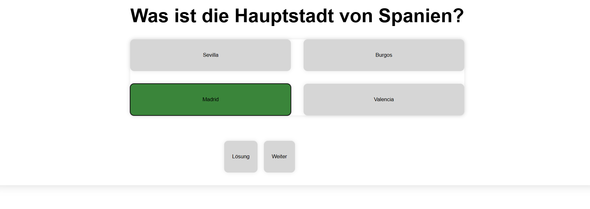

# **Quiz-App**



Das primäre Ziel dieses Projekts ist es zu üben, mit Arrays und Objekten in JavaScript zu arbeiten. Die interaktive Webanwendung wurde mit reinem HTML, CSS und JavaScript umgesetzt. Sie verwaltet Fragen und Antwortoptionen in strukturierten Datenobjekten innerhalb eines Arrays und rendert die Inhalte dynamisch zur Laufzeit im Browser.

## Voraussetzungen
Für den Betrieb dieses Projekts sind keine komplexen Laufzeitumgebungen, Build-Tools oder Datenbankkonfigurationen erforderlich. Zum Betrachten und Bearbeiten werden lediglich benötigt:
- Ein aktueller Webbrowser (z. B. Google Chrome, Mozilla Firefox, Microsoft Edge oder Safari).
- Ein Texteditor oder eine IDE (z. B. Visual Studio Code), falls der Quellcode editiert werden soll.

## Technologien
- HTML5: Bereitstellung eines minimalen Grundgerüsts mit zentralen Containern für die dynamische JS-Injektion.
- CSS3: Gestaltung des Layouts über CSS Flexbox (Hauptcontainer) und CSS Grid (zweispaltige Matrix für die Antwortschaltflächen) sowie visuelle Statusrückmeldungen.
- JavaScript (ES6+): Vollständige Steuerung der App-Logik über DOM-Manipulation, Zustandsverwaltung (`questionIndex`) und Event-Handling.
- Datenstrukturen: Speicherung des Fragenkatalogs in Form von Objekten mit den Eigenschaften `id`, `title`, `answer` (Array) und `correctAnswer`.

## Installation
Da es sich um eine statische Webanwendung mit nativem JavaScript handelt, entfällt ein Build-Prozess oder eine Paketinstallation. 

Das Projekt kann über Git lokal auf den eigenen Rechner kopiert werden:
```bash
git clone https://github.com
```

## Nutzung
1. Navigieren Sie in das Hauptverzeichnis des geklonten Projekts.
2. Öffnen Sie die Datei index.html per Doppelklick in Ihrem Webbrowser.
3. Die App bietet folgende interaktive Funktionen:
   - **Antworten mischen:** Bei jedem Aufruf einer Frage wird das Antwort-Array über einen mathematischen Zufallszeiger (`Math.random()`) neu angeordnet, um eine zufällige Platzierung auf den Buttons zu garantieren.
   - **Validierung:** Beim Klicken auf eine Antwort wird diese mit der Eigenschaft `correctAnswer` abgeglichen. Der Button erhält via Klassenliste dynamisch das Styling für ein korrektes Ergebnis (`.right`) oder ein fehlerhaftes Ergebnis (`.wrong`).
   - **Lösung anzeigen:** Über die Schaltfläche „Lösung“ kann die korrekte Antwort jederzeit vorab visuell hervorgehoben werden.
   - **Navigation:** Die Schaltfläche „Weiter“ erhöht den internen Index. Nach Erreichen der maximalen Fragenanzahl wird das Quiz über eine Kontrollstruktur zurückgesetzt und startet von vorn.

## Deployment
Die Anwendung ist für das Hosting über GitHub Pages optimiert. Das Deployment erfolgt über folgende Schritte:
1. Navigieren Sie in den Einstellungen (Settings) des GitHub-Repositories zum Menüpunkt Pages.
2. Wählen Sie unter Build and deployment den gewünschten Quell-Branch (main oder master) aus.
3. Nach dem Speichern generiert GitHub automatisch eine öffentlich erreichbare URL unter dem Schema: https://github.io

## Mitwirken
Dieses Repository dient ausschließlich als persönliches Übungs- und Portfolio-Projekt. Aus diesem Grund werden derzeit keine externen Code-Beiträge, Issue-Meldungen oder Pull Requests entgegengenommen.

## Lizenz
Das Projekt wurde von Xenia Wilczek entwickelt. Alle Rechte am Quellcode sowie an der logischen und gestalterischen Umsetzung sind vorbehalten (All Rights Reserved).
